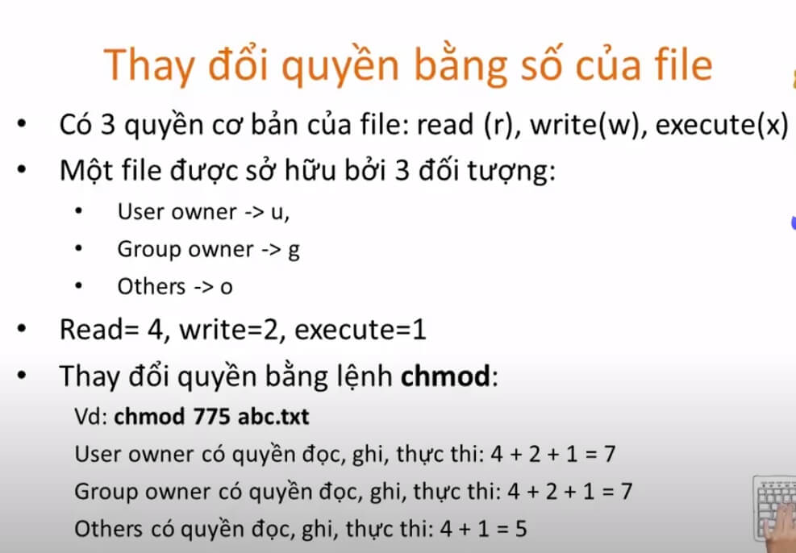
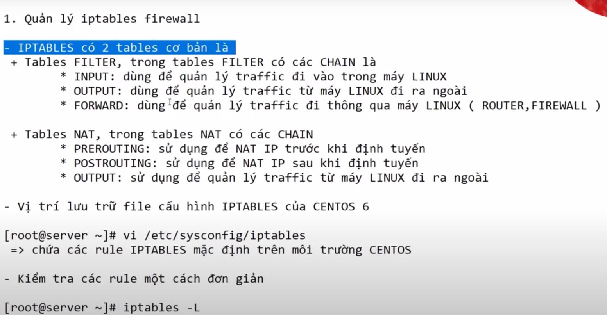
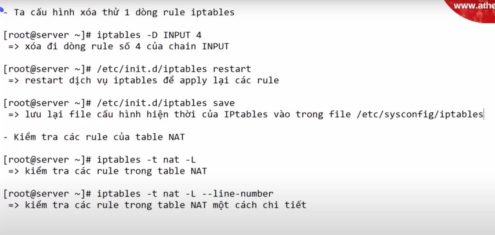
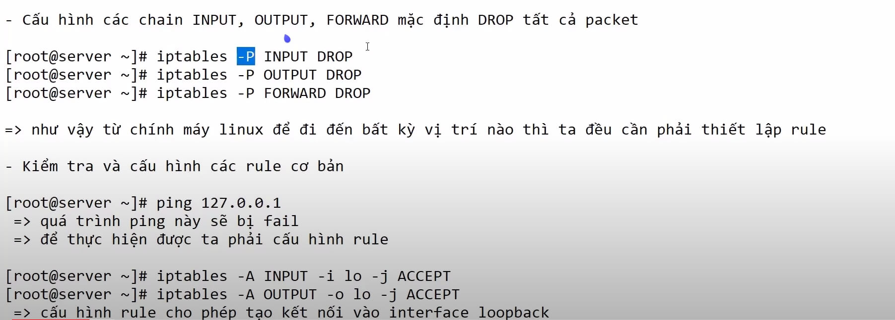
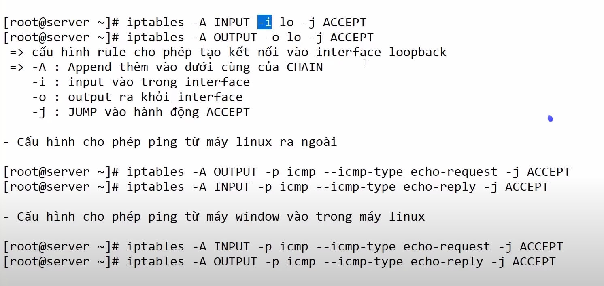
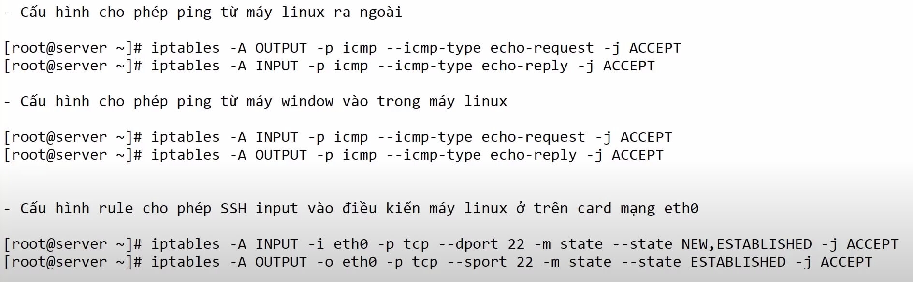
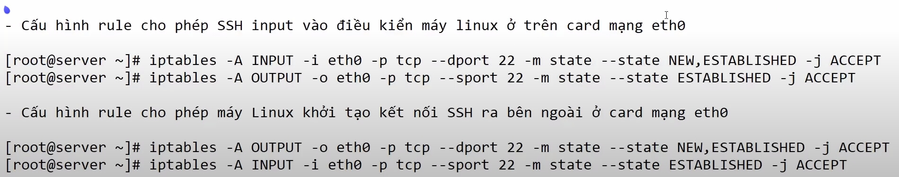
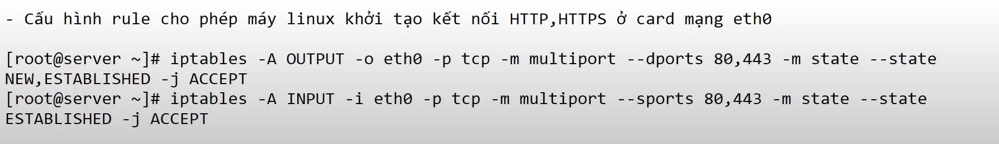
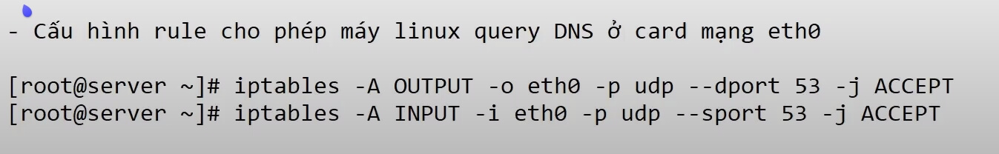

<h1 align="center"> CÂU LỆNH LINUX CƠ BẢN </h1>

## 1. Thao tác cơ bản với File, Folders

> Di chuyển giữa các folders

```
  cd <dir>
  cd ..
```

> Xem vị trí hiện tại

```
  pwd
```

> Xem cấu trúc folder hiện tại

- Chỉ tên file: `ls`
- Chi tiết: `ls -la`

> Tạo folders

```
  mkdir <dir_name_1> <dir_name_2> ...
```

> Tạo files

```
  touch <file_name_1> <file_name_2> ...
```

> Xoá file, folder (Xoá vĩnh viễn không vào trash). Sử dụng `trash-cli` tool nếu muốn xoá vào trash.

- Xoá file: `rm <file_name> ...`
- Xoá folders: `rm -r <dir_name>`
- Xoá bắt buộc (force): `rm -rf <file_name or dir_name> ...`

> Copy file và folder. Tạo file (folders) khi không

- Copy file

```
  cp <original_file_path> <target_file_path>
```

- Copy folder (Copy cả thư mục origin sang target. Nếu target đã tồn tại)

```
  cp -R <original_folder_path> <target_folder_path>
```

- Copy folder (Chỉ copy nội dung trong origin sang target)

```
  cp -R <original_folder_path>/ <target_folder_path>
```

> Di chuyển file, folders

```
  mv <original_file_path> <target_file_path>

  mv -R <original_folder_path> <target_folder_path>
```

> Xem kích thước file, folder

```
  du -sh <file_path>
```

> Đọc ghi file

```sh
  # Đọc toàn bộ file
  cat <file_path>

  # Đọc từ từ
  more <file_path>

  # Xem tuỳ biến lên xuống
  less <file_path>

  # Hiển thị 10 dòng đầu (cuối)
  head <file_path>
  tail <file_path>
  head -n <num_of_lines> <file_path>

  # Đọc file log (watching file)
  tail -f <log_file_path>
```

> Tìm kiếm file với `find`

```sh
  # Tìm kiếm theo tên trong thư mục base
  find <base_directory> -name <file_name>

  # Tìm kiếm tất cả file có đuôi là .conf
  find <base_directory> -name *.conf

  # Tìm kiếm các file có dung lượng lớn hơn 1000KB
  find <base_directory> -size +1000k

  # Tìm những file bị thay đổi theo ngày
  find <base_directory> -ctime -<num_of_days>
```

---

## 2. Quản lý người dùng

> Xem danh sách người dùng

```
  cat /etc/passwd
```

**Ex1:** `root:x:0:0:dyno:/root:/bin/bash`

- root: username
- x: shadow được mã hoá
- 0: user id
- 0: user group id
- dyno: tên người dùng
- /root: thư mục gốc của user
- /bin/bash: Shell mặc định của user (với `/usr/bin/nologin` hoặc `/sbin/nologin` thì user này không thề đăng nhập)

**Note:**

- Người dùng `root` (có quyền root) có id và group id là 0

> Xem thông tin đăng nhập (chứa mật khẩu đã mã hoá)

```
  sudo cat /etc/shadow
```

> Thêm người dùng

```sh
  useradd <user_name>

  # Kiểm tra thêm thành công chưa
  tail /etc/passwd

  # Đặt mật khẩu cho user
  passwd <user_name>
```

> Xem thông tin người dùng hiện tại

```
  id
```

> Chuyển người dùng

```
  su - <username>
```

> Xoá người dùng

```
  userdel <username>
```

---

## 3. Quản lý quyền sở hữu file

> Xem quyền sở hữu file

```
  ls -l <file_path>
```

**Ex:** `ls -l file` => `-rw-r--r--. 1 root root 0 Nov 19 23:49 file`


- root đầu: `username` người sở hữu
- root sau: tên nhóm sở hữu

> Thay đổi người (nhóm) sở hũu (change owner)

```sh
  # Người sở hữu
  chown <new_username> <file_path>
  # Nhóm sở hữu
  chown .<new_group> <file_path>
  # Người và Nhóm sở hữu
  chown <new_username>.<new_group> <file_path>
  chown <new_username>:<new_group> <file_path>
```

> Thay đổi quyền của file (Change mode)



- Thay về `0` nếu không muốn cấp quyền nào cả.
- Sử dụng +mod để thêm cho mọi nhóm. Ex: `chmod +x file.txt`

---

## 4. Dữ liệu vào/ra chuẩn và lỗi

```sh
  # Dữ liệu ra chuẩn
  stdout > file

  # Dữ liệu ra lỗi
  stderr 2> file

  # Dữ liệu ra chuẩn và lỗi
  stdout + stderr &> file
```

**Ex:**

```sh
  # dữ liệu ra chuẩn sẽ đc xuất vào file stdout.txt
  ls > stdout.txt

  # dữ liệu ra lỗi (do option -123 không hợp lệ) sẽ đc xuất vào file stderr.txt
  ls -123 2> stderr.txt

  # Chuẩn và lỗi
  ls && ls -123 &> std.txt
```

---

## Pipe command

> Đầu ra command_1 là đầu vào của command_2 ...

```
  command_1 | command_2 | ...
```

**Ex:**

```sh
  echo "foo bar baz" | wc -w
  # => 3
```

---

## Lọc dữ liệu

> Lọc dữ liệu theo dòng với `grep`

```sh
  grep <keyword> <file_path>

  # Hiển thị thêm số dòng
  grep -n ...

  # Không phân biệt hoa thường
  grep -i ...
```

> Lọc dữ liệu theo cột `cut`

```sh
  cut -d'<separator>' -f<column_num> <file_path>
```

**Ex:**

```
  cat input.txt

  1:2:3
  4:5:6
```

```
  cut -d':' -f2 input.txt
  => 2
     5
```

---

## Tiến trình - Process

> Liệt kê tiến trình do người dùng khởi tạo

```
  ps
```

> Liệt kê tất cả tiến trình (cả system)

```
  ps aux
```

> Huỷ 1 tiến trình đang chạy

```
  kill <PID>
```

---

## Xem cấu hình máy

```sh
  # CPU
  cat /proc/cpuinfo

  # RAM
  cat /proc/meminfo
  free -h

  # Ổ cứng
  df -h
```

---

## Cấu hình mạng cơ bản

> Lệnh xem địa chỉ mạng:

```sh
  ip a
  ip route
  cat /etc/resolv.conf

  # name server lookup
  nslookup <domain_name>
```

> Cấu hình card mạng

```sh
  /etc/sysconfig/network-scripts
  # ./ifcfg-<Card_name>
  # ./ifcfg-lo
```

> Cấu hình mạng

- vị trí lưu ở `/etc/netctl` hoặc `/etc/NetworkManager` (arch linux dùng netctl). Với Red hat base thì `/etc/systemconf/network-scripts`

---

## Cấu hình firewall với `iptables`. (Có thể dùng `firewalld`):

```
  sudo systemctl start iptables.service
```

- Mở port ở file `/etc/iptables/iptables.rules`

```sh
  # Empty iptables rule file
  *filter
  :INPUT ACCEPT [0:0]
  :FORWARD ACCEPT [0:0]
  -A INPUT -p tcp -m state --state NEW -m tcp --dport 22 -j ACCEPT
  -A INPUT -p tcp -m state --state NEW -m tcp --dport 80 -j ACCEPT
  -A OUTPUT -p tcp --dport 443 -j REJECT
  :OUTPUT ACCEPT [0:0]
  COMMIT
```

- Xem cấu hình iptables

```sh
  iptables -L
  iptables -L -v -n --line-number
```

- Dùng `netstat` hoặc `ss` để xem các port đang mở trên thiết bị:

```
  ss -tlpn
```









