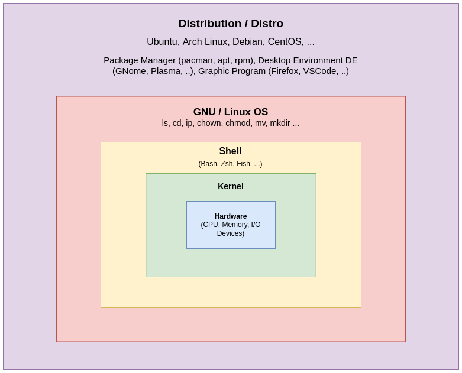

<h1 align="center"> Các khái niệm cần nắm trong Linux</h1>

## 1. Kernel, OS, Shell, Distribution

> **[Linux](linux.com/what-is-linux/)** về bản chất **không phải** là một hệ điều hành **(Operating System - OS)**, mà nó là một nhân **(Kernel)**. Là một phần và là quan trọng nhất của OS.

> [**Linux / GNU**](https://www.gnu.org/software/coreutils/) mới là một OS hoàn chỉnh.

> **Fact:** GNU's Not Unix 🤣

<div align="center">
  
</div>

---

## 2. Login shell và Non-login shell

> **Login shell** là quá trình mà hệ thống sẽ tự động source các file khi vừa đăng nhập hệ thống.

> **Non-login shell** sẽ được source mỗi khi bật lại terminal.

> Bash shell

```sh
  # Login shell
  /ect/profile
  ~/.bash_profile
  ~/.profile # Nếu không có file .bash_profile

  # Non-login shell
  /etc/bash.bashrc
  ~/.bashrc
```

> ZSH (Z Shell)

```sh
  # Login shell
  /etc/zsh/zshenv # tự tạo (thêm các biến môi trường như $ZDOTDIR)
  $ZDOTDIR/.zshenv

  /etc/zsh/zprofile
  $ZDOTDIR/.zprofile

  # Non-login shell
  /etc/zsh/.zshrc
  $HOME/.zshrc
  $ZDOTDIR/.zshrc
```
